# Olist E-Commerce Analytics — Excel

An end-to-end Brazilian e-commerce data analysis project built with Microsoft Excel, Power Query, Power Pivot, DAX, PivotTables, PivotCharts, and Excel formulas.

The project analyzes sales performance, customer behavior, delivery performance, payment methods, product categories, sellers, and customer reviews using the Olist Brazilian E-Commerce Public Dataset.

---

## Project Objective

The objective of this project is to build a complete data analyst workflow starting from raw e-commerce data and ending with an interactive Excel dashboard.

The analysis focuses on:

- Sales and order performance
- Customer behavior and repeat customers
- Product category performance
- Regional and state-level sales
- Delivery performance
- Payment methods
- Seller performance
- Customer review ratings
- Data quality and validation

---

## Dataset

This project uses the **Olist Brazilian E-Commerce Public Dataset**.

The dataset contains multiple related tables representing different parts of the e-commerce business:

- Customers
- Orders
- Order Items
- Payments
- Reviews
- Products
- Sellers
- Geolocation
- Product Category Translation

The raw CSV files are intentionally not included in this repository. They are kept locally and excluded through `.gitignore`.

---

## Tools & Technologies

- **Microsoft Excel**
- **Power Query**
- **Power Pivot**
- **DAX**
- **PivotTables**
- **PivotCharts**
- **Excel formulas**
- **Slicers**

---

## Project Workflow

```text
Raw CSV Data
     ↓
Data Quality Audit
     ↓
Power Query Transformation
     ↓
Data Cleaning & Validation
     ↓
Data Model / Power Pivot
     ↓
DAX Measures & Calculations
     ↓
Exploratory Data Analysis
     ↓
PivotTables & PivotCharts
     ↓
Interactive Dashboard
     ↓
Business Insights
```

---

## Data Preparation

Power Query was used to prepare the raw data before analysis.

Key transformations included:

- Data type validation
- Null and duplicate analysis
- Removal of exact duplicate geolocation records
- Product category translation
- Customer and seller geolocation enrichment
- Order-level item aggregation
- Order-level payment aggregation
- Order-level review aggregation
- Payment method consolidation
- Review comment flags
- Review rating categories
- Product data quality flags
- Geolocation match status
- Delivery duration calculations
- Delivery performance classification
- Timeline anomaly detection
- Freight percentage calculations

Business-meaningful missing values were preserved rather than globally replacing them.

---

## Data Quality & Validation

The raw dataset was profiled before transformation.

Important validation checks included:

- Duplicate record checks
- Null value analysis
- Primary key uniqueness
- Foreign key integrity
- Orphan record checks
- Negative value checks
- Zero-value payment checks
- Review score validation
- Order timeline validation
- Delivery date consistency
- Product metadata completeness
- Geolocation matching

All major referential integrity checks between the core tables returned zero orphan records.

Special cases such as missing delivery dates, incomplete product metadata, repeated review IDs, zero-value payments, and timeline anomalies were preserved and flagged rather than silently removed.

---

## Data Model

The analytical model uses `Orders_Analytical` as the central order-level table.

Main relationships:

```text
Customers
    │
    └── 1 : *
        Orders_Analytical
             │
             ├── 1 : * Order_Items
             │          │
             │          ├── Products
             │          └── Sellers
             │
             ├── 1 : * Payments
             │
             └── 1 : * Reviews
```

The model was implemented using Excel Power Pivot.

### Data Model Screenshot

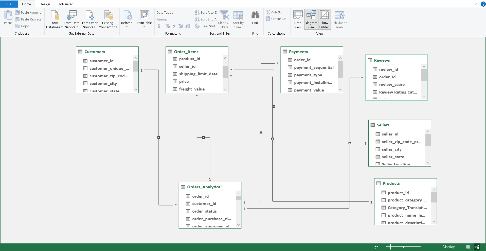

---

## Power Query

Power Query was used to create reusable transformations and analytical summaries instead of performing manual transformations directly in the worksheets.

Important analytical queries included:

- `Order_Item_Summary`
- `Order_Payment_Summary`
- `Order_Payment_Methods`
- `Order_Review_Summary`
- `Order_Written_Review_Count`
- `Geolocation_Lookup`
- `Orders_Analytical`

### Power Query Screenshots

#### Query Structure

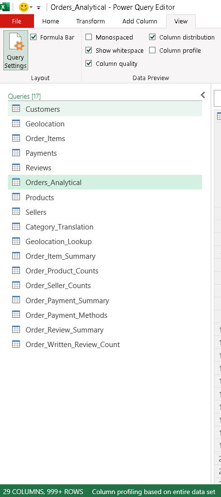

#### Orders Transformations

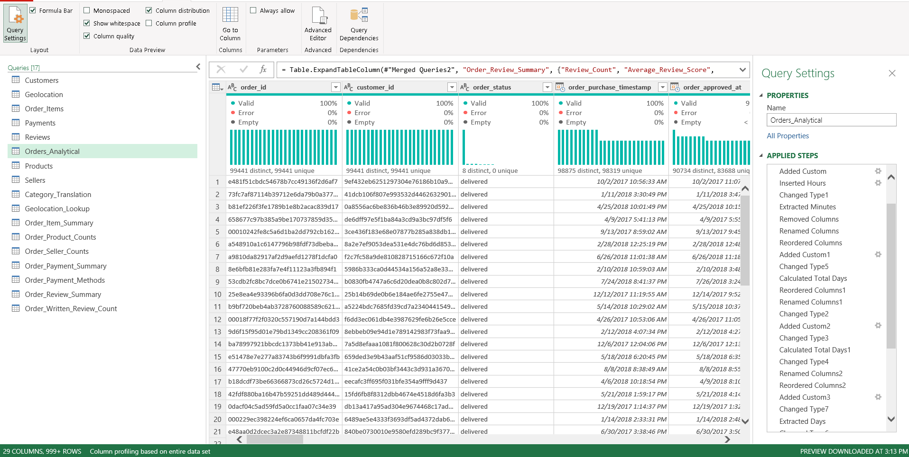

#### Product Category Translation

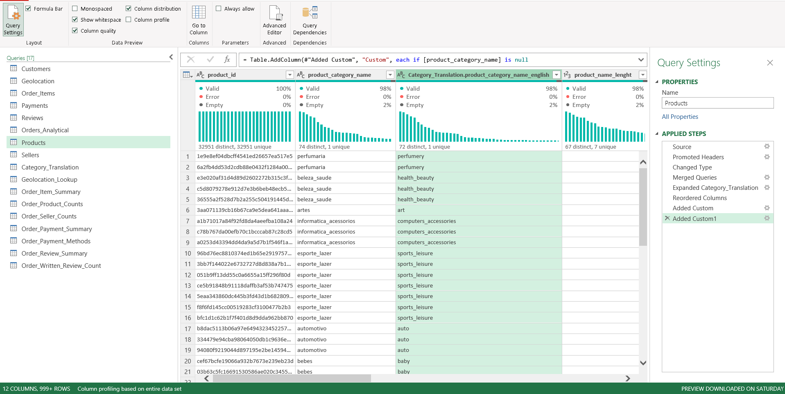

#### Geolocation Lookup

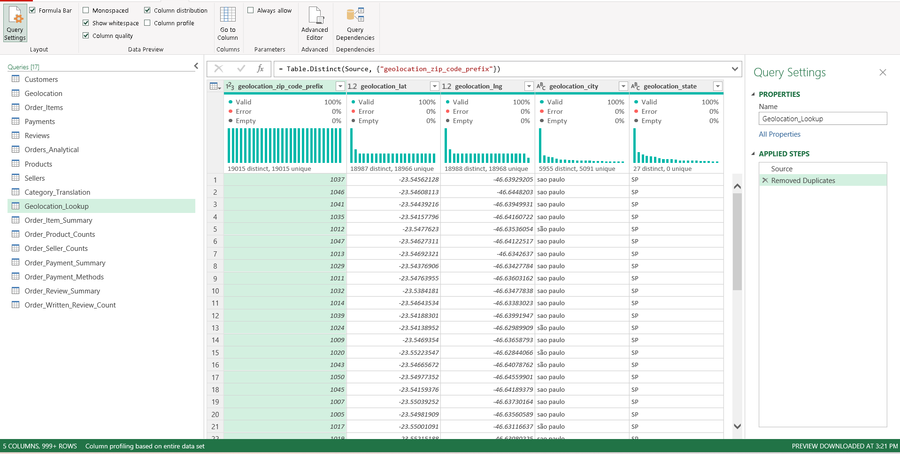

#### Order Item Summary

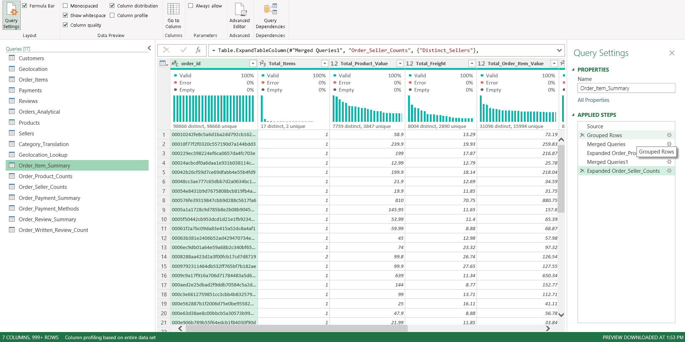

#### Payment Summary

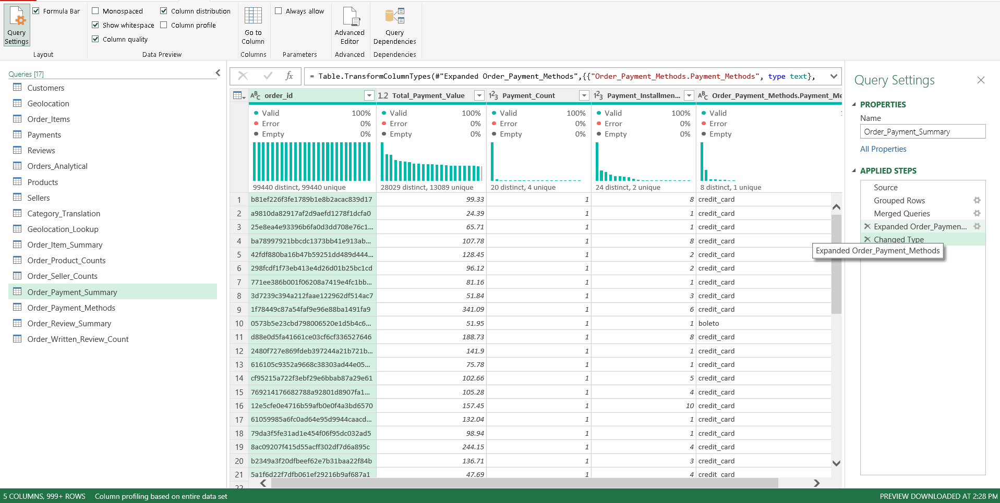

#### Review Summary

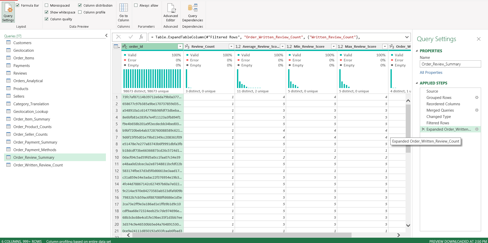

---

## Exploratory Data Analysis

The project uses PivotTables, PivotCharts, formulas, and DAX measures to investigate different business questions.

Analysis areas include:

### Sales & Orders

- Monthly order volume
- Monthly sales trends
- Product category sales
- Product category item volume
- State-level sales
- State-level order volume
- Customer city sales
- Seller sales

### Customers

- Unique customers
- Repeat customers
- Repeat customer rate
- Sales contribution from repeat customers

### Operations

- Delivery duration
- Delivery performance
- Late deliveries
- On-time deliveries
- State-level delivery duration

### Payments

- Payment value by payment method
- Payment record counts
- Payment method combinations
- Payment record quality

### Customer Experience

- Review score distribution
- Written review availability
- Review rating categories

### EDA Screenshots

#### Monthly Order Volume

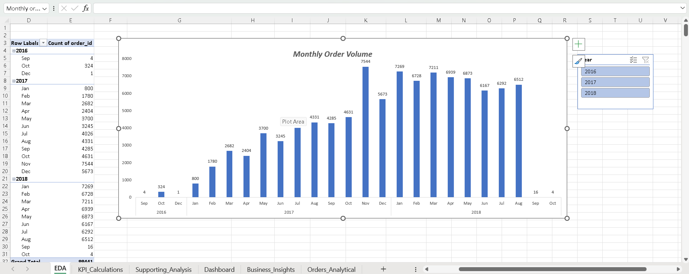

#### Delivery Performance

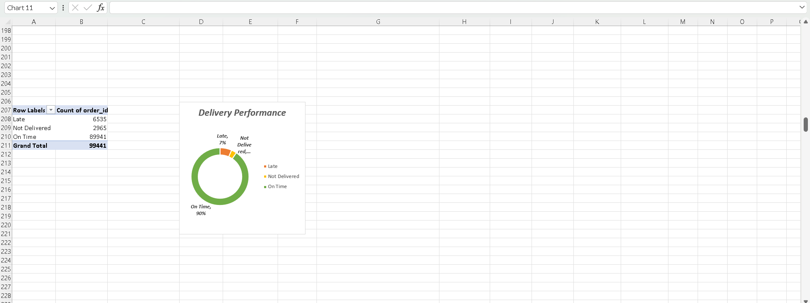

#### Repeat Customers

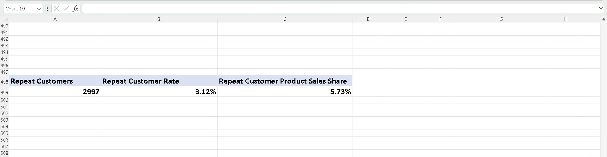

#### Slowest Locations by Delivery Duration

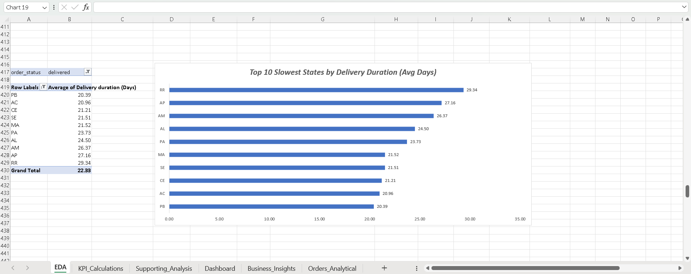

#### Queries and Connections

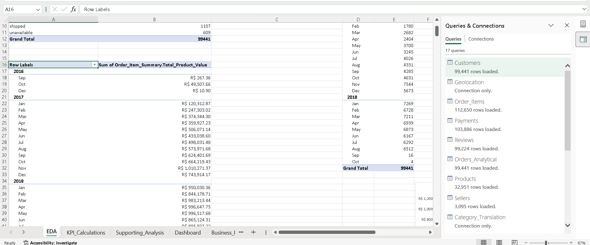

---

## Key KPI Measures

The final dashboard includes the following measures:

| KPI | Value |
|---|---:|
| Total Orders | 99,441 |
| Total Product Sales | R$13,591,643.70 |
| Average Order Value | R$136.68 |
| Unique Customers | 96,096 |
| Total Items Sold | 112,650 |
| Average Review Score | 4.09 |
| Average Delivery Days | 12.52 |
| On-Time Delivery Rate | ~93.23% |
| Late Delivery Rate | ~6.77% |
| Repeat Customer Rate | 3.12% |

The dashboard KPIs are designed to respond dynamically to the Year slicer.

---

## Interactive Dashboard

The final Excel dashboard provides an interactive overview of:

- Total orders
- Total product sales
- Average order value
- Unique customers
- Average delivery days
- On-time delivery rate
- Monthly sales trend
- Order delivery status
- Top product categories
- Top states by sales
- Payment value by method
- Customer review score distribution

A Year slicer allows the dashboard to be explored across different years.

### Dashboard — All Years

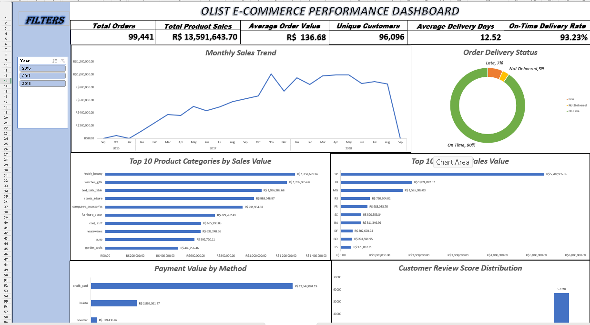

### Dashboard — 2017

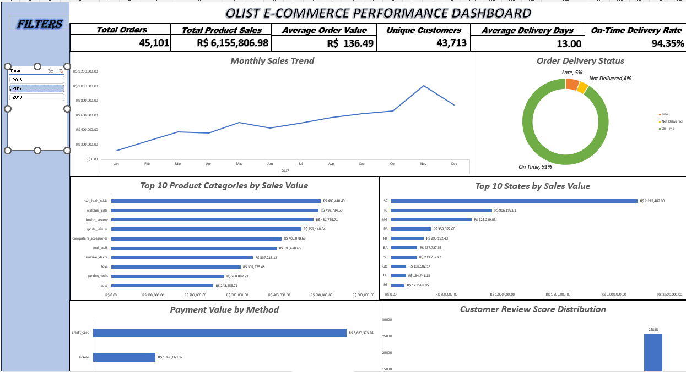

---

## Business Insights

### 1. Sales are concentrated in a few states

São Paulo generated approximately **R$5.20M** in product sales, followed by Rio de Janeiro at approximately **R$1.82M** and Minas Gerais at approximately **R$1.59M**.

This shows a strong concentration of sales in a small number of states.

### 2. Repeat customers represent a small part of the customer base

There are approximately **2,997 repeat customers** out of **96,096 unique customers**, giving a repeat customer rate of approximately **3.12%**.

### 3. Repeat customers contribute a higher share of sales

Repeat customers generated approximately **R$778.82K** in product sales, representing about **5.73%** of total product sales.

Their sales contribution is therefore higher than their share of the customer base.

### 4. Sales increased over time but monthly performance fluctuated

The monthly sales trend shows overall growth across the dataset period, although individual months vary considerably.

September 2018 is a partial period in the dataset and should be interpreted accordingly.

### 5. High total-sales categories are not necessarily high-price categories

The categories generating the most total sales are different from the categories with the highest average sales value per item.

There is no overlap among the Top 5 categories for total sales value and the Top 5 categories for average item price.

### 6. Payment value is concentrated in major payment methods

Credit card and boleto account for the largest share of payment value, while debit card and voucher contribute smaller amounts.

### 7. Customer reviews are heavily concentrated at 5 stars

The review distribution contains:

- 1 star: 11,424
- 2 stars: 3,151
- 3 stars: 8,179
- 4 stars: 19,142
- 5 stars: 57,328

Five-star reviews are the largest group.

### 8. Most delivered orders were on time

The dashboard's delivery KPI shows an on-time delivery rate of approximately **93.23%** among delivered orders with an actual delivery date.

The broader delivery-status analysis also identifies orders that were not delivered and orders classified as late.

---

## Project Limitations

- The dataset represents Olist's Brazilian e-commerce activity and may not represent the entire Brazilian e-commerce market.
- The available dataset contains historical data rather than live transaction data.
- September 2018 is a partial period and should not be compared directly with complete months without considering coverage.
- Some product records contain incomplete metadata.
- Some geolocation records do not have a matching customer or seller location.
- Some orders contain timeline anomalies that were preserved and flagged rather than modified.
- The repository does not contain the raw CSV files.

---

## Repository Structure

```text
olist-ecommerce-excel-analysis/
│
├── data/
│   └── raw/
│       └── Raw CSV files kept locally and ignored by Git
│
├── excel/
│   └── Olist_Ecommerce_Analytics.xlsx
│
├── documentation/
│   ├── business_insights.md
│   ├── project_overview.md
│   └── ...
│
├── screenshots/
│   ├── dashboard/
│   ├── data-model/
│   ├── eda/
│   └── power-query/
│
├── .gitignore
└── README.md
```

---

## How to Use

1. Download `Olist_Ecommerce_Analytics.xlsx`.
2. Open it using Microsoft Excel Desktop.
3. Open the dashboard sheet.
4. Use the Year slicer to explore the analysis.
5. Review the supporting analysis and data model when needed.

The workbook contains the Power Query transformations and Power Pivot data model used for the analysis.

Because the raw CSV files are excluded from the repository, refreshing the Power Query pipeline on another computer requires the original raw files and the corresponding source paths to be configured locally.

---

## Skills Demonstrated

This project demonstrates practical skills in:

- Excel data analysis
- Power Query
- Data cleaning
- Data validation
- Data transformation
- Data modeling
- Power Pivot
- DAX
- PivotTables
- PivotCharts
- KPI development
- Business analysis
- Dashboard development
- Data storytelling
- Data quality analysis

---

## Project Outcome

The project converts multiple raw e-commerce datasets into a structured analytical model and interactive Excel dashboard.

It demonstrates an end-to-end workflow from:

**Raw Data → Data Cleaning → Data Modeling → Analysis → KPIs → Dashboard → Business Insights**

---

## Author

**M. Faiz Bepari**

Data Analyst | SQL | Excel | Power BI | Tableau | Python

Linkdin: [https://www.linkedin.com/in/m-faiz-bepari/]
GitHub: [https://github.com/mfaizbepari-cmd]